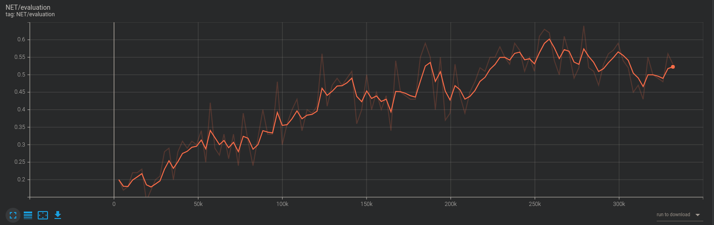

# Thunder

代码库目前正在重构，可能无法运行，对此，我深表歉意 

**Thunder** 是一个深度强化学习包（平台），目前仍有很大的不足。该项目将会随着个人的学习逐步完善。

同时重要的是，该项目欢迎任何人提出的想法，改进与贡献。

## 毕业设计

使用该平台，完成了本科毕业设计，其使用深度强化学习算法SAC完成基于视觉的机械臂抓取任务。由于时间限制与硬件限制，在完全无先验知识的视觉伺服抓取任务中，其并没有取的很好的结果。

### 深度强化学习算法
使用**Thunder**项目中实现的SAC算法来训练模型。由于硬件限制，CNN神经网络默认结构参数很小。

### 非视觉伺服抓取任务
在训练30万步后，模型在jaco机械臂上的抓取率达到了64%，其训练时抓取率变化图如下所示：

同时模型在Kuka机械臂上只训练了16万步其抓取率就达到了77%，该差异是由于urdf模型文件引起的。其训练是抓取率变化图如下所示：

### 视觉伺服抓取任务
对于这个小模型来讲，这个问题似乎太难了，模型难以收敛，但是在减少学习的控制量后，模型依然学习到了一些东西，其训练时抓取率变化图如下所示：

### 演示
#### 非视觉伺服抓取任务
##### jaco

##### kuka

#### 视觉伺服抓取任务

