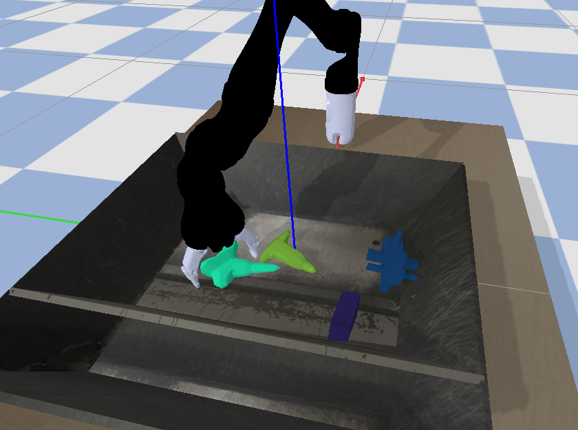

# 毕业设计

我的毕业设计，使用深度强化学习算法完成基于视觉的机械臂抓取任务。由于时间限制，且花费大量的时间在研究视觉基于抓取的问题，它并没有达到一个很好的结果。我将在后续说明。该毕业设计是未来将要推出的 ***Koala*** 项目的预览版本。

## 抓取任务
通常，抓取任务使用结构分析或深度学习算法，前者不能被广泛使用，后者需要大量的人力来构建数据集。深度强化学习算法可以很好的解决两个问题

### 非视觉伺服抓取任务
第一类抓取任务是非视觉伺服抓取。该方法只需要检测执行抓取动作前的目标点即可。如下图所示：


### vision servo based grasping task
第二类抓取任务是视觉伺服抓取，该方法在每一个时间步都要依据视觉信息选择一个最有利于抓取的动作，直到完成抓取。如下图所示：


## 深度强化学习算法
我使用了SAC（软演员-评论家）算法来训练模型。事实上，由于硬件的限制，模型不得不很小。
### 演员

### 评论家


## 结果
### 非视觉伺服抓取任务
在训练30万步后，模型在jaco机械臂上的抓取率达到了64%，其训练时抓取率变化图如下所示：


但是模型在Kuka机械臂上只训练了16万步其抓取率就达到了77%，该差异是由于urdf模型文件引起的。其训练是抓取率变化图如下所示：


### 视觉伺服抓取任务
对于这个小模型来讲，这个问题似乎太难了，模型难以收敛，但是在减少学习的控制量后，模型依然学习到了一些东西，其训练时抓取率变化图如下所示：


## 演示
### 非视觉伺服抓取任务
#### jaco


#### kuka


### 视觉伺服抓取任务


## 参考文献
```
@article{haarnoja2018soft,
  title={Soft actor-critic algorithms and applications},
  author={Haarnoja, Tuomas and Zhou, Aurick and Hartikainen, Kristian and Tucker, George and Ha, Sehoon and Tan, Jie and Kumar, Vikash and Zhu, Henry and Gupta, Abhishek and Abbeel, Pieter and others},
  journal={arXiv preprint arXiv:1812.05905},
  year={2018}
}
```