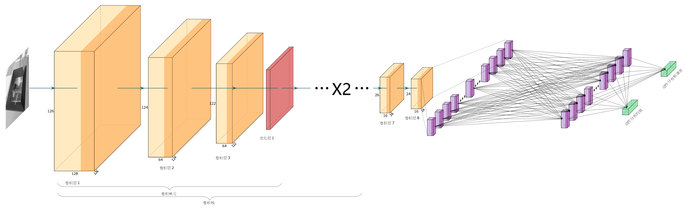

# Graduation Project

[中文](./README-ZH.md)

This is my graduation project, a vision-based robotic grasp task by using the deep reinforcement learning.
Due to time constraints, and spending most of the time researching the visual-servo based grasp problem, it did not achieve a very good result. I will explain later. And this will be the pre-view version of ***Koala*** Project.

## Grasp Task
Usually, the grasping task uses the method of structural analysis or the method of deep learning, the former cannot be widely used, and the latter requires a lot of manpower to construct the data set.The deep reinforcement learning method can solve two problems very well

### non-vision servo based grasping task
The first kind of grasping task is a non-visual grasping task. The model only needs to detect the target point before executing the grasping action.


### vision servo based grasping task
The second kind of grasping task is vision servo based grasping task, and the model needs to judge the next action based on the visual information of each step.


## The DRL Algorithm
I use the SAC(soft actor-critic) algorithm to train the model. Actually, because of the limitation of hardware, the model has to be small. 
### actor

### critic


## Results
### non-vision servo based grasping task

After training for 300,000 steps, the model achieved a grasping rate of 64% on non-visual servo grasping tasks using the jaco robotic arm.The following is the change curve of its crawl rate.


But the model achieved a grasping rate of 77% only after training for 160,000 steps if using the Kuka robotic arm. The following is the change curve of its crawl rate.


### vision servo based grasping task

For this small model, the complete vision servo grasp problem seems too hard and the model fails to converge. But after reducing the amount of control to learn, the model can still learn something. The following is the change curve of its crawl rate on vision servo grasping task.


## Demo
### non-vision servo based grasping task
#### jaco


#### kuka


### vision servo based grasping task


## Cite
```
@article{haarnoja2018soft,
  title={Soft actor-critic algorithms and applications},
  author={Haarnoja, Tuomas and Zhou, Aurick and Hartikainen, Kristian and Tucker, George and Ha, Sehoon and Tan, Jie and Kumar, Vikash and Zhu, Henry and Gupta, Abhishek and Abbeel, Pieter and others},
  journal={arXiv preprint arXiv:1812.05905},
  year={2018}
}
```